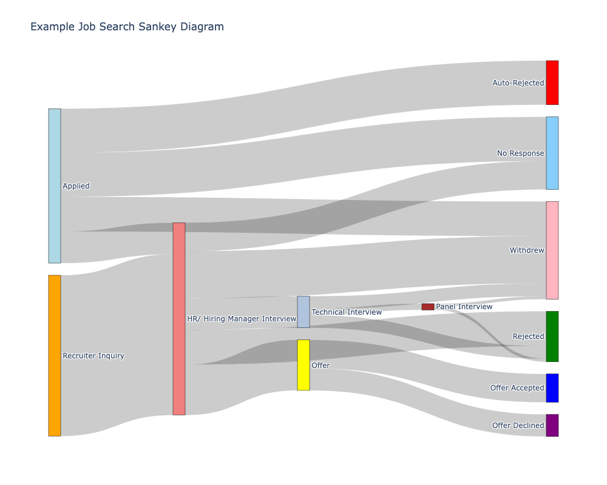

# Job Search Sankey 

## Overview

This project visualizes the flow of job applications through different interview stages using Sankey diagrams. The goal is to better understand how job applications progress, where bottlenecks or drop-offs occur, and how many interviews ultimately lead to offers.

This Sankey diagram visualizes the flow of job applications through various interview stages. Each node represents a stage in the process (e.g., Applied, Recruiter Inquiry, Technical Interview), and the width of the connecting arrows indicates how many applications moved between those stages. This visualization helps identify common paths, bottlenecks, and outcomes in a job search.



## What it Does

- Visualizes application flow through various interview stages (e.g., "Applied", "HR Call", "Technical Interview", "Offer").
- Quantifies and displays how many applications moved between each stage.
- Helps you identify drop-off points and common paths through the job search process.
- Tracks transitions by company, stage, and time period.


## Getting Started
1. Clone the repo
2. Set up a `venv` or Python Kernel in Jupyter Notebooks
3. Install dependencies in the `requirements.txt` file:
```
pip install -r requirements.txt
```
4. Update user input values by creating a `.env` file
5. Run all cells in the notebook


## Data

The input is a `.csv` file containing transitions between stages for each job application. Each row represents a source → target transition (e.g., `"Applied"` → `"HR Call"`), along with company name.

The input file format is expecting the following columns:
| Company      | Source                           | Target                         |
|--------------|----------------------------------|--------------------------------|
| Company1     | Applied                          | HR/ Hiring Manager Interview   |
| Company1     | HR/ Hiring Manager Interview     | Technical Interview            |
| Company1     | Technical Interview              | Panel Interview                |
| Company1     | Panel Interview                  | Offer                          |
| Company1     | Offer                            | Offer Accepted                 |

`SOURCE_COLUMN`: The initial stage of each application step (e.g., "Applied")

`TARGET_COLUMN`: The next stage (e.g., "Technical Interview", "Rejected")

Users can upload a CSV file with any column structure, but must specify in the configuration which columns represent the source stage and target stage to generate the Sankey diagram correctly. Other columns can be included in the file, but will be ignored in the analysis.

## Configuration

To customize the visualization for your own job search data, you'll need to configure a few values. This project uses a `.env` file to store those settings.

### Step 1: Create a `.env` file

Start by copying the example configuration:

```bash
cp .env.example .env
```

### Step 2: Configure environment variables

Then open the .env file and fill in the required fields based on your CSV file:  
`INPUT_FILE`=your-data.csv             # Path to your CSV file  
`SOURCE_COLUMN`=Source                 # Column name representing the starting stage of a transition  
`TARGET_COLUMN`=Target                 # Column name representing the next stage of a transition  
`VIS_TITLE`=Job Search Sankey Diagram  # Title to display on the Sankey diagram  


## Technologies
- Python
- Pandas
- Plotly (for Sankey diagram generation)
- Jupyter Notebook


## Stage Transitions
The program can handle any interview stage transitions you provide. However, to analyze and compare progress effectively, it’s important to use a consistent set of stages and keep them in the same logical order, even if the actual steps happened in a different sequence. This consistency allows meaningful comparisons across different companies and application processes. Below are the specific stages I used in my analysis, based on my personal job search experience:


### Possible Mappings
**Applied/ Recruited**
- Recruiter Inquiry → HR/ Hiring Manager Interview  
- Applied → Auto-Rejected  
- Applied → HR/ Hiring Manager Interview  
- Applied → No Response
- Applied → Withdrew

**Hiring Manager Interview**
- HR/ Hiring Manager Interview → No Response  
- HR/ Hiring Manager Interview → Rejected  
- HR/ Hiring Manager Interview → Offer  
- HR/ Hiring Manager Interview → Technical Interview   
- HR/ Hiring Manager Interview  → Withdrew  

**Technical Interview**
- Technical Interview → Panel Interview  
- Technical Interview → Rejected  
- Technical Interview → Withdrew  

**Panel Interview**
- Panel Interview → Withdrew  
- Panel Interview → Rejected  
- Panel Interview → Offer  

**Offer**
- Offer → Offer Accepted  
- Offer → Offer Declined  


## Use Cases
- Identify common failure points in the application process
- Compare how companies handle recruiting
- Visualize application volume by stage or over time